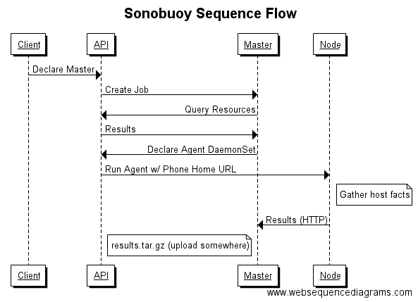

# Sonobuoy Host Fact Aggregation

Aside from just querying API objects, Sonobuoy also dispatches "agents" into the cluster, running as a DaemonSet, to gather results and phone them home to the main Sonobuoy instance.

This brings Sonobuoy into two distinct modes (which can be addressed by separate commands/images in the future:)

- Sonobuoy "master"
- Sonobuoy "agent"

The Sonobuoy "master" is what runs when you haven't run any subcommands, and its job is to query the Kubernetes API server for information, and optionally, to dispatch agents.

The Sonobuoy "agent" is responsible for gathering information about the host that it is on, and phoning those results home to a sonobuoy master.

## Sequence Flow

- A client (somewhere) declares a sonobuoy Job in a Kubernetes cluster, similarly to the [sonobuoy Job YAML examples](https://github.com/heptio/sonobuoy/tree/master/yaml).  This will launch Sonobuoy in "master" mode.  (TODO: it'd be nice if a sonobuoy CLI, usable on your desktop, can define this for you, so you don't have to mess with the YAML yourself?)
- The Sonobuoy master, running in the Job, will query the API server for all the resources it's configured to query, storing them in the results directory
- The Sonobuoy master defines a DaemonSet in the kubernetes cluster which runs on all nodes
- The DaemonSet pods each run Sonobuoy in an "agent" mode, configured with a phone home URL and their node name [1]
- Each agent gathers host facts (using ansible, and later other pluggable host fact gathering modules like log analysis) and submits them back to the master over HTTP
- The master packages up the results and uploads them (TODO still)

[1] Configuration of agents is done with the aid of the kubernetes "Downward API", assigning an environment variable `NODE_NAME` to the `spec.nodeName` item in the downward API.  Configuration of the phone-home URL is done with a configmap.

## Code packages

**pkg/agent**: This is the code for the Sonobuoy agent.  This currently consists of the phone-home client code, plus code that dispatches out to `pkg/ansible` on the agent. We will add more gathering bits than just ansible going forward.

**pkg/aggregator**: This is the code for the Sonobuoy aggregator.  This is responsible for hosting the HTTP server for nodes to phone home to, waiting for results to come in, and signalling to the caller (via the `complete` channel) when all nodes have checked in.  

**pkg/dispatch**: This code is responsible for the logic for dispatching sonobuoy Agents to the cluster.  This consists of creating the ConfigMap (which holds the phone home URL and the rest of the agent configuration) and the DaemonSet (which deploys the agents themselves.)

**pkg/ansible**: Used by the agent package, the ansible package is responsible for calling out to ansible on the current machine and gathering facts from the [ansible "setup" plugin](http://docs.ansible.com/ansible/setup_module.html).  It isn't responsible for phoning them home, the agent package does that.
