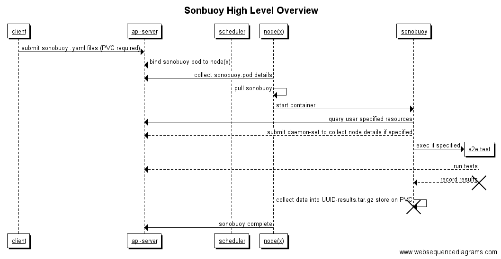

# How Sonobuoy Works

## Configuring 
Sonobuoy takes as input, a single `config.json` file that can either be located in its local directory or under `/etc/sonobuoy/config.json`.  For convenience, there is an example `config.json` provided in the root of the repository to allow operators to simply download the repo and evaluate sonobuoy without having to download containers.

Sonobuoy can be configured to collect different sets of data, which can vary depending on your use case, for a complete list of all the input options look [here.][inargs]  This data includes:

* kubernetes resources
* node details
* pod and node logs
* e2e test results

Once the config is loaded, sonobuoy will parse the config settings and gather according the input parameters.  Depending on the input options, sonobuoy may submit more pods to collect node information. 

## Containerized Sequence Flow 

For more details on node data collection, see the [aggregation doc.][aggregation]

[aggregation]: https://github.com/heptio/sonobuoy/blob/master/doc/aggregation.md
[inargs]: https://github.com/heptio/sonobuoy/blob/master/pkg/discovery/config.go#L41
